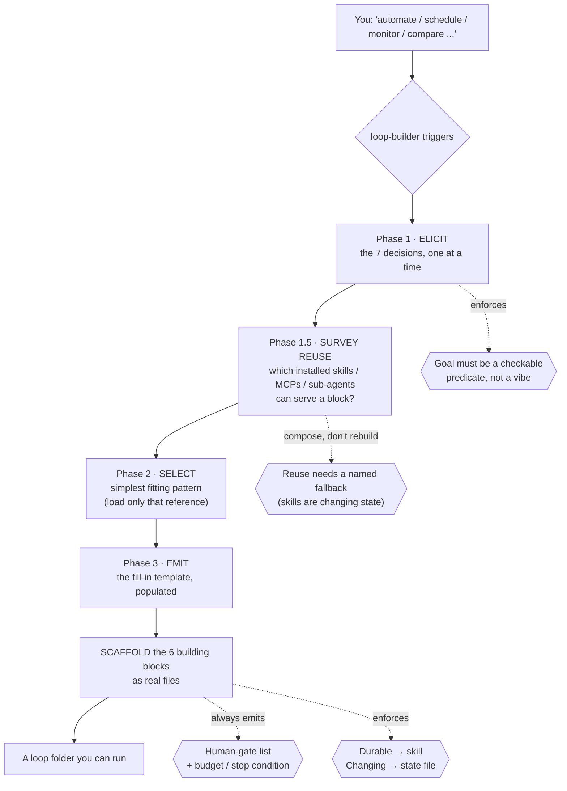
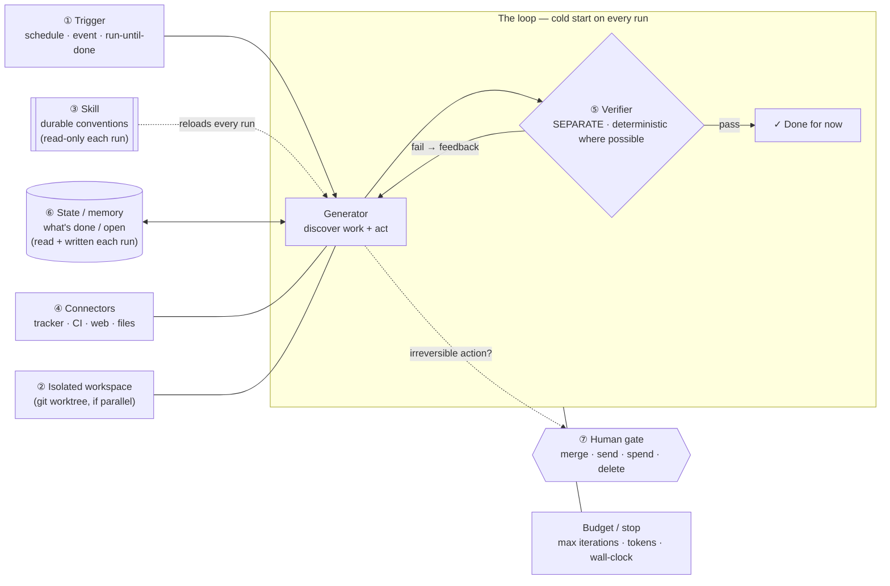
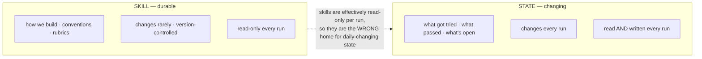

# loop-builder

A [Claude Code](https://docs.claude.com/en/docs/claude-code) **skill** that guides you through designing and scaffolding an agent **loop** — an unattended, scheduled, self-verifying agent workflow — for whatever you describe, and writes the files for you.

> Automate a recurring task, schedule an agent, set up monitoring or triage, run an agent overnight, or turn a manual workflow into a self-running one — **even if you never say the word "loop."**

---

## Why this exists

A loop is **not one long prompt**. It is a small self-running system in which an agent finds work, acts, gets graded against explicit criteria by a *separate* checker, and repeats — until the criteria pass or a budget runs out, without a human typing each turn.

The reason loops need engineering at all is one blunt fact:

> **The agent starts cold every run.** It forgets everything between runs. So conventions, commands, and "what's already done" must live *outside* the context window, on disk. **The agent forgets; the repo does not.**

Designing that system by hand each time is error-prone — people forget the verifier, leak mutable state into the wrong place, or ship a loop with no stop condition. `loop-builder` turns the design into a repeatable interview + scaffold so every loop you build has the parts that keep it safe and trustworthy.

---

## How the skill works

When it triggers, it runs in phases — **elicit → survey reuse → select → scaffold** — and never skips ahead, because a loop with a missing part is the failure mode, not a shortcut.



### The seven-question blueprint (Phase 1)

Every loop, whatever its purpose, comes down to seven decisions. Each maps to a building block:

| # | Decision | The question it answers |
|---|----------|-------------------------|
| 1 | **Goal (recursive)** | What *verifiable* condition means "done for now"? (a checkable predicate, e.g. "every P1 issue has an owner + plan comment" — not "keep the repo healthy") |
| 2 | **Trigger** | What fires it — a schedule, an event, or run-until-done? |
| 3 | **Discovery** | How does the agent *find* work each cycle? |
| 4 | **Action** | What may it *do*, through which tools? |
| 5 | **Verification** | Who checks the result, and against what? (a **separate** checker) |
| 6 | **State / memory** | Where does "what's done / what's open" persist *outside* the context? |
| 7 | **Human gates** | Which actions are irreversible and need approval first? |

(Plus two non-optional captures: the **durable knowledge** to put in the loop's skill, and the **budget/stop** condition.)

### Survey reuse before building (Phase 1.5)

Once the decisions are clear, the skill checks **what's already installed** that can *serve a block* rather than be rebuilt — an existing skill, MCP connector, or sub-agent. This is the "compose blocks; don't reach for a framework you can't debug" principle applied to the build itself: the loop shouldn't re-derive a capability it already has. Findings are mapped to blocks (e.g. a different-model skill as the **verifier**, an MCP as a **connector**, a research agent as a **worker**), and anything wired in gets a **named fallback** — because an external skill is *changing* state you don't control, and a cold start must still work if it's missing or has changed.

---

## Loop architecture (what gets scaffolded)

The skill recommends the **simplest pattern that works** and then generates **six building blocks**. Here is the anatomy of a loop it produces:



### The six building blocks — what each means and why it's there

| # | Block | Its job | What breaks without it |
|---|-------|---------|------------------------|
| 1 | **Automation / scheduling** | The heartbeat: fires on a cadence, or runs until a condition holds | You have a one-off session, not a loop |
| 2 | **Isolated workspaces** (git worktrees) | Keep parallel agents from colliding on files | Parallel agents corrupt each other's work |
| 3 | **Skill** (`SKILL.md`) | Codify durable knowledge once so the loop stops re-deriving conventions | Every run is day one; knowledge never compounds |
| 4 | **Connectors** (MCP / tools) | Plug into real systems — read the tracker, open the PR, post to Slack | The agent *comments* instead of *operating* |
| 5 | **Sub-agents** | Split the maker from the checker; each gets fresh context | The worker grades its own homework |
| 6 | **Memory / external state** | Hold what's done and what's next, outside the context window | The cold-start agent repeats work and loses the thread |

### The one rule that runs through everything: durable vs. changing

Blocks 3 and 6 are constantly confused. They are not interchangeable — and putting mutable state inside a `SKILL.md` is the classic anti-pattern. `loop-builder` enforces this split in everything it generates:



### The loop patterns (pick the simplest that works)

The skill selects **one** and loads only its reference file (progressive disclosure):

- **ReAct + deterministic verifier** *(the default)* — one workstream whose "done" check is a *program* (tests, a schema check, a predicate script), not a model's opinion.
- **Evaluator–optimizer** — clear criteria that need *judgement*: a generator proposes, a *separate* evaluator grades against a rubric, repeat.
- **Orchestrator–workers** — work that *genuinely* parallelizes: an orchestrator fans subtasks to isolated workers, then synthesizes.
- **Ralph** — the crudest viable loop (a `while` loop against a fixed spec); useful as a baseline and teaching device.

> Guidance the skill repeats: **compose the simplest blocks; don't reach for a framework you can't debug.** A single loop with a deterministic verifier beats an elaborate multi-agent system you can't reason about.

---

## Why the implementation is shaped this way

A few deliberate choices, and the reasoning behind each:

- **`SKILL.md` body kept under ~500 lines, depth pushed into `references/`** — *progressive disclosure*. A loop pays token cost on every tick; skills preload only name + description and load the body when relevant, and load bundled references only when a specific pattern is chosen. This keeps the per-run context small while still carrying deep knowledge.
- **Deterministic verifiers live in `scripts/`, not in prose** — verification is the part that must be reliable, so it belongs in code with a binary exit status a scheduler can branch on. The bundled scripts are **red-green tested** (`scripts/tests/`): the test was written first, watched fail, then made to pass.
- **The verifier is always *separate* from the generator** — a model grading its own output is too generous. The maker/checker split is the single most important guardrail.
- **Every generated loop ships a human-gate list AND a budget** — prompt injection is unsolved, so a loop that reads issues/email/web ingests untrusted text every cycle; the durable defense is a *permanent human gate on irreversible actions* (merge, send, spend, delete). And a loop with no stop condition is a runaway cost. The skill refuses to call a loop "done" if either is missing.
- **Durable knowledge → the loop's own skill; changing progress → an external state file** — enforced in every artifact, never blurred.

---

## Repository layout

```
loop-builder/                  ← clone this into ~/.claude/skills/loop-builder
├── SKILL.md                   the skill: elicit → select → scaffold (< 500 lines)
├── references/
│   ├── loops-and-loop-engineering.md      the knowledge backbone (source of truth)
│   ├── pattern-react-deterministic-verifier.md
│   ├── pattern-evaluator-optimizer.md
│   ├── pattern-orchestrator-workers.md
│   └── pattern-ralph.md
├── scripts/
│   ├── verifier_template.sh               generic predicate runner (exits non-zero on fail)
│   ├── verify_no_p1_unassigned.sh         worked example (operates on gh-style JSON)
│   └── tests/                             red-green tests + fixtures
├── evals/evals.json           trigger test prompts (positive + negative)
├── docs/design-spec.md        how this skill itself was designed
├── LICENSE
└── README.md
```

---

## Install

```bash
# clone directly into your Claude Code skills directory
git clone https://github.com/AaronLPS/loop-builder.git ~/.claude/skills/loop-builder
```

Or drop it into a single project at `<project>/.claude/skills/loop-builder/`.

## Use

Just describe what you want — the skill is tuned to trigger without the word "loop":

- *"Help me automate triaging my GitHub issues every morning."*
- *"I want an agent to watch CI and open a fix PR when the nightly build breaks."*
- *"Set something up to review my inbox each morning and draft replies."*

It will walk the seven questions, recommend a pattern, and scaffold the loop into `<project>/loops/<loop-name>/` — including a separate verifier, an external `STATE.md`, and a `HUMAN-GATES.md` (gates + budget).

## Test the bundled verifiers

```bash
bash scripts/tests/test_verifiers.sh
```

---

## References & sources

The concepts here are not invented; they come from the loop-engineering literature, captured and graded in [`references/loops-and-loop-engineering.md`](references/loops-and-loop-engineering.md), which is the skill's knowledge backbone. Key sources:

**Primary / originating**
- **Addy Osmani — *Loop Engineering*** (addyosmani.com, June 2026): coined the term and the six-block anatomy.
- **Boris Cherny** (Head of Claude Code, Anthropic) and **Peter Steinberger** — the "write loops, not prompts" framing.

**Official (Anthropic)**
- *Equipping agents for the real world with Agent Skills* (anthropic.com/engineering) — Skills definition, progressive disclosure.
- [Agent Skills documentation](https://docs.claude.com) and the open standard (agentskills.io).
- *Building Effective Agents* (Anthropic) — the evaluator–optimizer and orchestrator–workers patterns.

**Peer-reviewed / academic**
- *Externalization in LLM Agents: Memory, Skills, Protocols and Harness Engineering* (arXiv) — the memory-vs-skills taxonomy.

**Secondary explainers** (blog-grade; treat specific numbers with caution)
- *The New Stack* — the prompt → context → harness → loop lineage.
- Geoffrey Huntley — the Ralph technique.

> **Uncertainty flag.** Loop engineering as a named practice is months old as of mid-2026. The core concepts (cold-start, six blocks, skills-vs-memory, maker/checker) are consistent across primary and official sources. **Specific product mechanics — `/loop`, `/schedule`, dynamic intervals — come mostly from secondary reporting and may have shifted; verify them against current Claude Code / Codex docs before relying on them.** The skill preserves this flag in everything it generates.

---

## License

[MIT](LICENSE) © 2026 AaronLPS. Fork it, improve it, make it yours.
